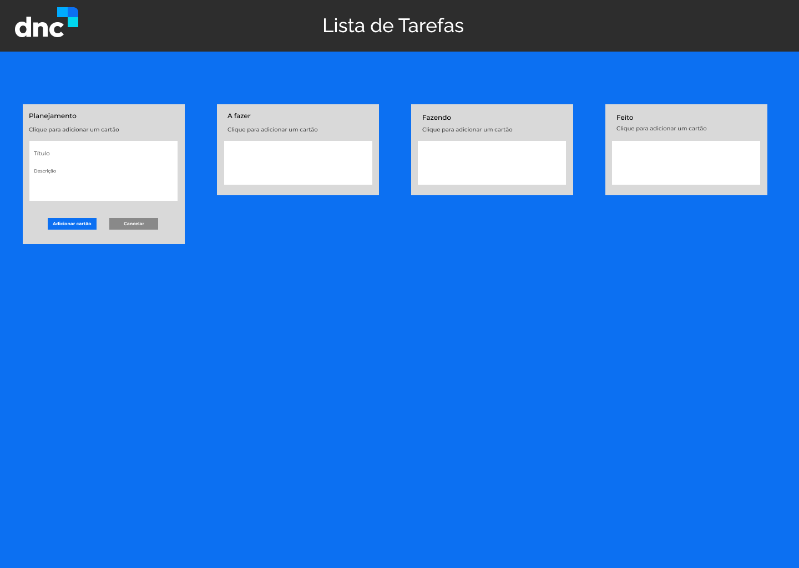

<h1 align="center"> DNC - To Do List ✅ </h1>
 

  

## 💻 About the project:

This project was developed as a way to study how to use the useState and useRef in React, for this project I have used the [Figma provide by DNC](https://www.figma.com/file/Gjcn2y4hvZGDSJ9ENR7CsB/Din%C3%A2mica---Day-10?node-id=0%3A1&t=OAqZ0uIToywtQ905-0) to develop a simple To Do List.

## ⚡️ This project was developed using this following techs:
  <ul>
    <li> HTML & CSS</li>
    <li> JavaScript</li>
    <li> React Framework</li>
    <li> Figma</li>
 </ul>
 

 Hope you enjoy as much as I have! ⭐
